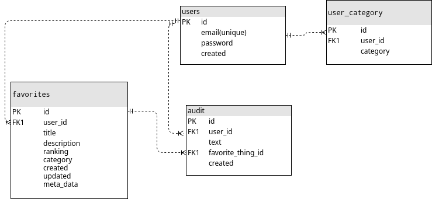

# favorite-things

- Folder backed contains everything related to run backend.
- Same folder structure for frontend.
  Frontend is a Single Page React App.

### DB schema

###Approach
 - A new table `user_category` is defined to store categories defined by users. 
 By default it gets populated with 3 categories ["person","place,"food"] as soon as a new user is created.
 - The most important part of the application was to reorder the list of favorite things 
   whenever user changes category and/or ranking of the favorite things.
   
    
   This logic was developed on both frontend and backend. 
   This logic was also build into frontend because the user wants to see
   the result of action performed by user. 
   frontend makes an network request and updates the state locally because the network request may fail or may take few 
   seconds depending on the internet connection.
   
     
    The logic is as follows:

     - only ranking is changed 
        - is old rank is greater than new rank?
            - no, decrement ranking of favorite things between (old rank, new rank] and assign the new rank to the
            updated favorite thing
            - yes, increment ranking of favorite things between [new rank, old rank) and assign the new rank to the
            updated favorite thing
     - category changed
        - decrease ranking of other favorite things of old category having ranking greater than old ranking of to be 
        updated favorite thing.
        - increase ranking of other favorite things of new category having ranking greater than new ranking of to be 
        updated favorite thing.
        - assign category and ranking(if present else last ranking in the new category) to the favorite thing.
        
     - Audit logs are created on every user actions.
     
     
     
### Deployment

- backend : flask-uwsgi server running on an aws ec2 instance with nginx as reverse proxy.
 
I tried aws lambda and zappa but i was facing issues after deployment.
I almost spend one day to trouble shoot the problems.
- Frontend is deployed on aws s3 bucket.
